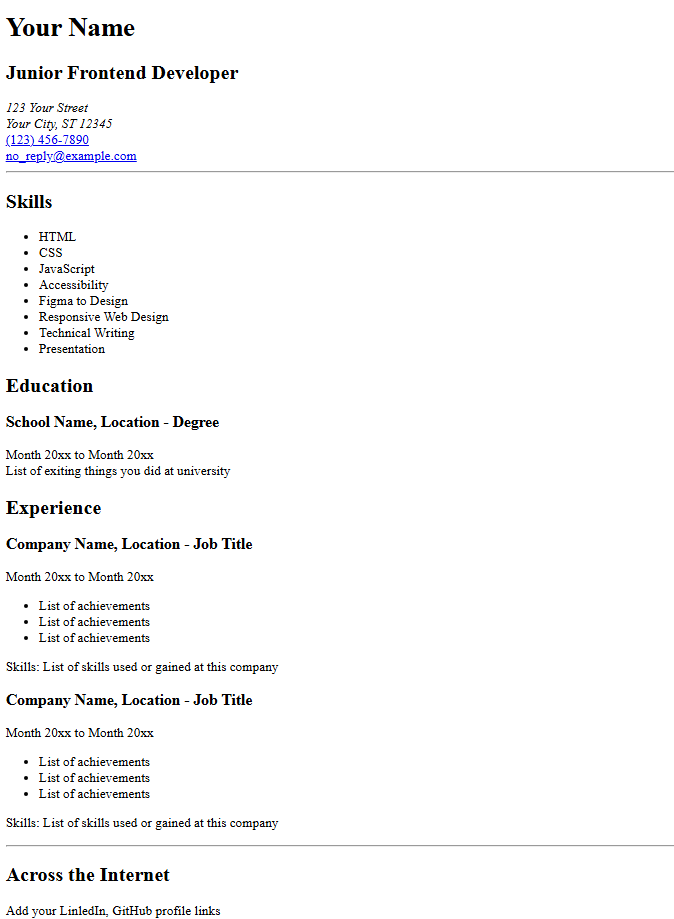

This is my first ever project on HTML only.
It`s a single-page CV.

-------
Preview:



-------
How to launch:

Clone the repository:

```bash
git clone https://github.com/Mihasik556/My-first-project-CV-.git
```
Open index.html in a browser.

-------
It is a project from the roadmap.sh

URL: [https://roadmap.sh/projects/single-page-cv](https://roadmap.sh/projects/single-page-cv)
